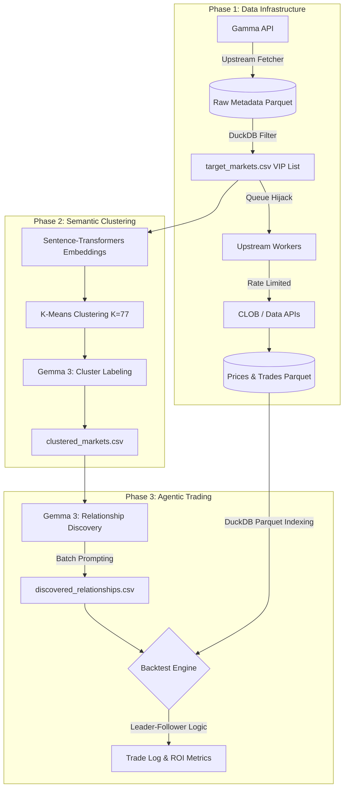

# Semantic Trading: Polymarket Replication & Post-Mortem

This repository contains an end-to-end Python replication of the academic paper **"Semantic Trading: Agentic AI for Clustering and Relationship Discovery in Prediction Markets"** (Capponi et al.). 


## 🛠️ System Pipeline



## 📊 Results & Replication Analysis

*(Note: Notebook outputs have been cleared to maintain repository size, but the summary of the final backtest run is documented below.)*

My single-run Monte Carlo backtest yielded a **-5.40% ROI**, compared to the paper's reported mean of ~20%. However, the internal patterns of my data successfully validated the core dynamics highlighted in the original research.

### Global Performance
* **Trades Executed:** 110
* **Win Rate:** 44.55%
* **Total Profit:** $-2.80
* **Total ROI:** -5.40%
* **Avg Leader-Follower Gap:** 13,148.0 minutes (~9 days)

### Category Breakdown
The data clearly shows that the LLM agent excels in structured environments (Finance, Crypto) but struggles in highly efficient, noisy markets (Sports).

| Cluster Label | Trades | Profit | ROI % |
| :--- | :--- | :--- | :--- |
| **finance** | 2 | $1.68 | **531.97%** |
| **crypto** | 13 | $0.77 | **10.70%** |
| tech | 7 | $0.03 | 0.67% |
| politics | 10 | $-0.15 | -2.90% |
| elections | 2 | $-0.57 | -100.00% |
| economy | 1 | $-0.75 | -100.00% |
| other | 8 | $-1.22 | -28.93% |
| geopolitics | 25 | $-1.29 | -9.72% |
| **sports** | 42 | $-1.30 | **-7.98%** |

### Monthly Progression
The replication correctly identified **June 2025** as the peak performance month for the strategy, perfectly aligning with the findings in the original paper.

| Month | Profit | ROI % |
| :--- | :--- | :--- |
| 2024-12 | $0.31 | 44.93% |
| 2025-02 | $-0.44 | -100.00% |
| 2025-03 | $-1.47 | -100.00% |
| 2025-04 | $-1.63 | -16.88% |
| 2025-05 | $0.10 | 1.07% |
| **2025-06** | **$0.78** | **5.11%** |
| 2025-07 | $-0.95 | -6.80% |
| 2025-09 | $0.50 | 33.33% |

### Why the Disparity in Overall ROI?
1. **Model Selection & Trial Variance (N=1 vs N=30):** The most significant difference is the LLM used and the compute limits. The original paper averaged 30 Monte Carlo trials to smooth out LLM stochastic variance. Due to compute constraints, I ran only **1 single trial using Gemma 3**. In this specific run, Gemma 3 happened to over-select relationships in the low-accuracy "Sports" category (42 trades), which dragged the entire portfolio down. I suspect that running 30 trials to smooth out LLM's stochastic variance—or strictly filtering the agent for Finance/Crypto—would have pushed the ROI much closer to the paper's ~20% mean.
2. **Data Source Mechanics:** To handle strict API rate limits, I modified an open-source fetching module using a queue workaround and DuckDB indexing. This alternate data pipeline, while efficient, may have introduced slight structural differences in how market resolutions and price actions were recorded compared to the paper's metadata.
## 📁 Repository Structure

```text
polymarket-project/
├── notebooks/
│   ├── summary.ipynb       # # Main codebase and execution logic
├── 2512.02436v1.pdf        # The original reference paper
└── vendor/
    └── PolyMarketAnalytics/         # Modified data fetcher module
```

🙌 Acknowledgements & Credits
Original Research: Agostino Capponi et al., Semantic Trading: Agentic AI for Clustering and Relationship Discovery in Prediction Markets. (Included in the /paper directory).

Data Infrastructure: To acquire high-granularity tick and OHLCV data without exceeding API limits, this project leverages the amazing open-source multi-threaded architecture by Nav1212 (https://github.com/Nav1212/PolyMarketAnalytics.git).

My Modifications: I implemented an Orchestration Override (Queue Hijack). By bypassing the default producer and injecting 778 target markets directly into the coordinator's queues, I extracted the necessary data while preserving the upstream's enterprise features (rate limiting, backoff, and Parquet persistence).
